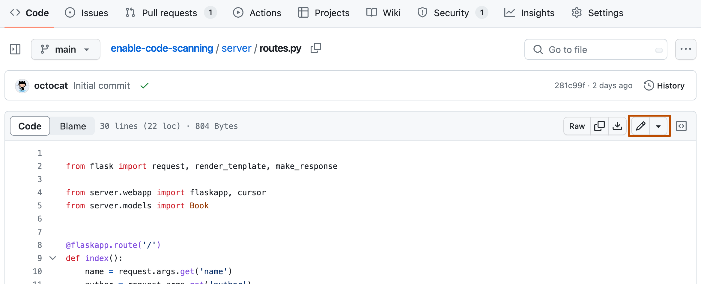
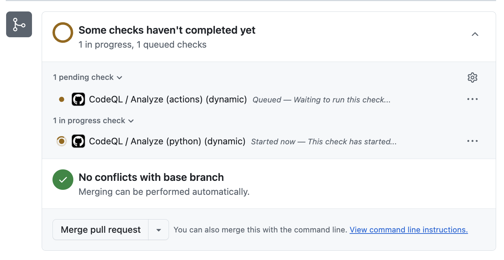
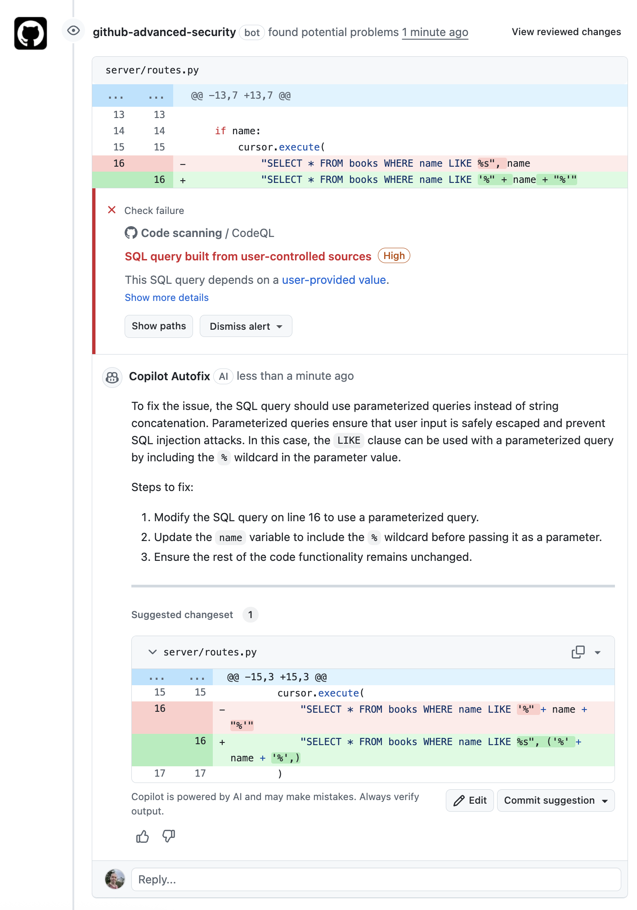
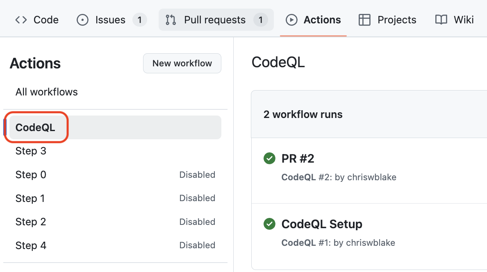
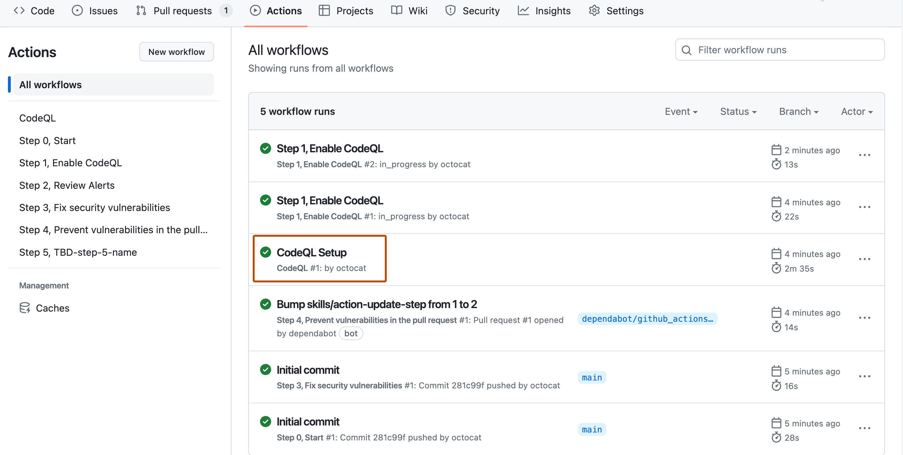
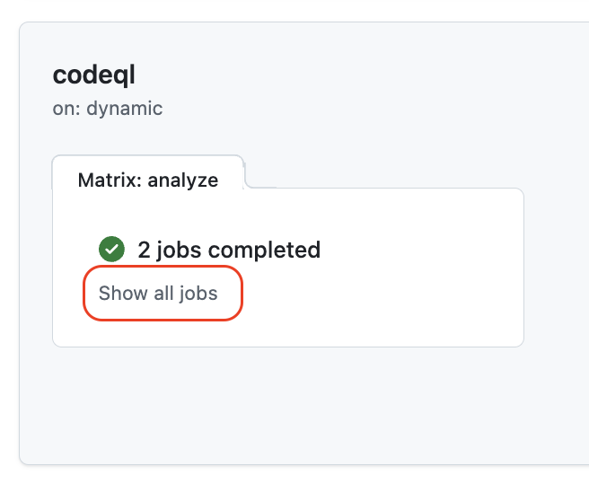
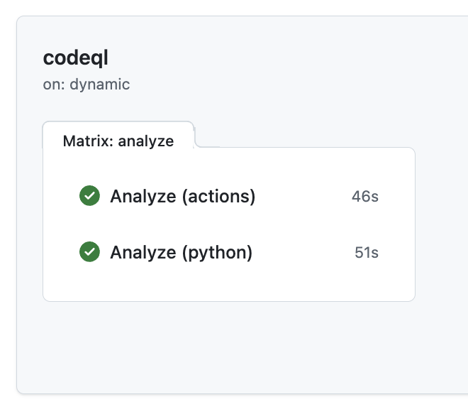
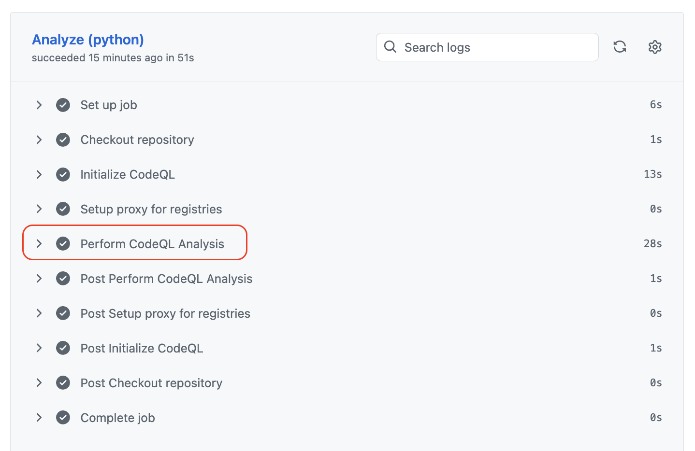

## Step 2: Detect Vulnerabilities in a Pull Request

To see how Code Scanning works, we will introduce a vulnerability into the `routes.py` file to trigger an alert.

### ⌨️ Activity: Create a vulnerability

1. In the top navigation, select the **Code** tab.

1. Navigate to the `server` folder and select the `routes.py` file.

1. In the top right of the preview, click the **Edit** button.

   

1. Navigate to about **line 16** and modify it to the below.

   ```py
   "SELECT * FROM books WHERE name LIKE '%" + name + "%'"
   ```

1. Above the editor in the top-right, click the **Commit changes...** button. In the prompt window, select the radio button for the **Create a new branch** option. **DO NOT commit to the main branch.**

1. Click the **Propose changes** option and click **Create pull request**. Use the below branch name.

   ```txt
   learning-codeql
   ```

1. On the new page, below the pull request description, press the **Create pull request** button.

### ⌨️ Activity: Review pull request

1. If needed, navigate to the newly created pull request from the previous activity.

1. Scroll to the bottom of the pull request and search for a check named `CodeQL`. This is the analysis job scanning the proposed code changes in the pull request.

   

1. If the job is still running, wait a few minutes for it to complete.

1. Search the comments to find the results of the analysis.

   - Notice that the results found a SQL injection vulnerability. It also suggests a fix.
   - Don't worry about responding to this or resolving the problem (yet).

   

   > 💡 Tip: Clicking the **Show paths** link will provide additional insights about the alert's data flow from user input (source), through the application, and when it is acted on (sink).

### ⌨️ Activity: View the CodeQL scanning logs

1. In the top navigation, select the **Actions** tab.

1. In the left navigation, select the **CodeQL** entry to filter the workflow runs.

   

1. Click on the workflow run with the name **PR #2** to open a page with more details.

   

1. Expand the run jobs by clicking **Show all jobs** then click on the **Analyze (python)** entry. The list of all workflow steps is now shown.

   

   

1. Find the analysis entry and consider reviewing the logs.

   

1. With the pull request started and CodeQL scan finished, Mona will check your progress and share the next steps.

> [!TIP]
> Check out the [Triage code scanning alerts in pull requests](https://docs.github.com/en/code-security/code-scanning/automatically-scanning-your-code-for-vulnerabilities-and-errors/triaging-code-scanning-alerts-in-pull-requests) page to learn more about integration of code scanning into pull requests.
