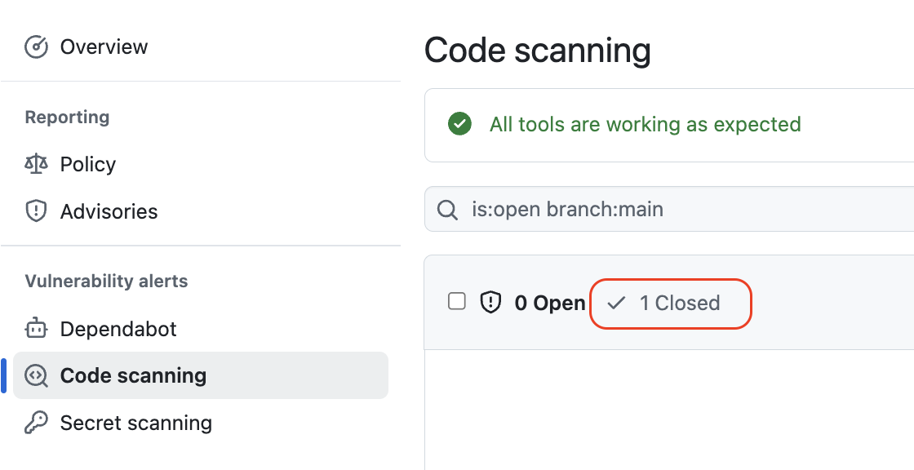
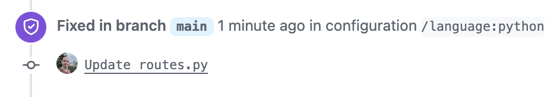

## Step 4: Fix Security Vulnerabilities

Finally, let's use the information provided by CodeQL to better understand the vulnerability and fix it.

### ⌨️ Activity: Resolve an open alert

1. Review the open alert and become familiar with the recommended changes.

1. In the top navigation, select the **Code** tab.

1. Ensure you are on the `main` branch then navigate to the `server` folder and select the `routes.py` file.

1. In the top right of the preview, click the **Edit** button.

   

1. Navigate to about **line 16** and modify it to the below.

   ```py
   "SELECT * FROM books WHERE name LIKE %s", name
   ```

1. Above the editor in the top-right, click the **Commit changes...** button. Use the defaults options to commit directly to the `main` branch.

   - CodeQL will now initiate a another scan.

1. Wait a moment for the **CodeQL** workflow to finish.

1. Return the the **Security** tab and **Code Scanning** area.

   - There should be no open alerts and 1 closed alerts. Nice work! 🎉
   - Feel free to review the closed alerts, especially the audit trail.

1. Click on **Closed** to show our recently resolved alert.

   

1. Open our alert and notice the audit trail now includes how the alert was fixed.

   

1. With our alert fixed, Mona will check your progress and share a final review. Nice work! You are all done! 🥳
